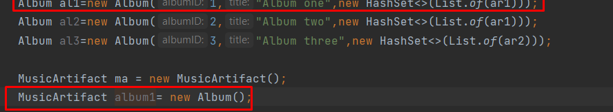
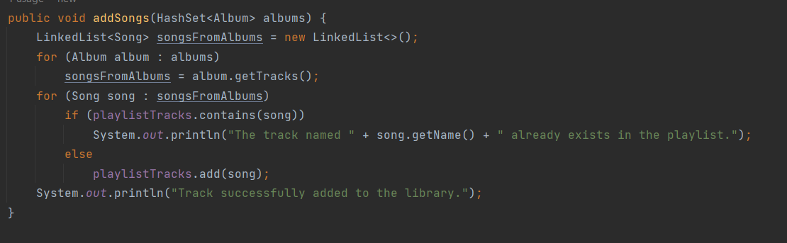
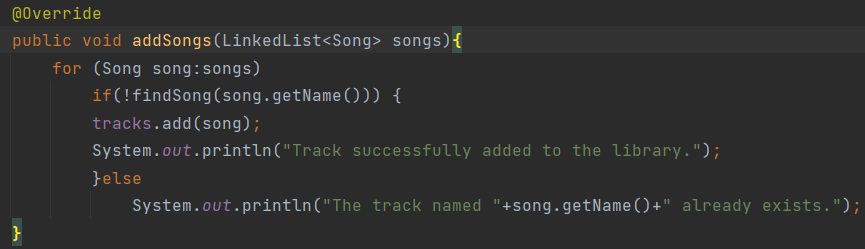

# upskill-nov22
Repository for the UPSKILL autonomous study weeks (08/11 - 18/11 2022)

First week: review of OOP in Java
1. OPP:
•	Polymorphism
•	Inheritance
•	Abstraction/Abstract classes
•	Encapsulation
2. Collections
3. Multithreading
4. Serialization
5. Design patterns (most popular)

Day 1 08-11:
    Watched tutorial to get an idea of a project where I could implement the ideas above - https://www.youtube.com/watch?v=49eeLxc6xE4
    Decided to create a music player, similar system to ipod - user can listen to songs, skip them and obtain info about them (as a basic version)
    Created classes from the video (Song and Album) with respective methods.
    Noticed that Album is a data structure and not an object. In the video implementation the Artist is related only to the album and not to the song. I would like to archive independence. Therefore, decided to apply Inheritance to Song and Album with Artist. Also, one album or one song might have several artists.
    Later I decided to create a MusicArtifact class. This class contains atributes and methods that will be used in Album, Artist and Song (used Inheritance).
 -  Reviewed concepts:
    Constructors: initialize the instance variable of the class (in a default state as defined). Method that is called at runtime during the object creation.
    Empty constructor: instance of object without need of paramethers (if by any chance an empty object of that type is needed).
    Getters and setters: used to obtain or change the values of the object without changing manually in the declaration - basic best practice.
    Encapsulation: set where variables can be used, using public, protected, private. In this project I had to set variables to private for them to only accessible in the class or protected if they are accessed by inheritance. Getters and setters where used to obtain or change the values of the object without changing manually in the declaration.
    Inheritance and Polymorphism: helps with reusability and reduces code length. A base class is written where has attributes and methods that can be used by classes which contain the same ones. Polymorphism is about the usage of inherited methods to perform a different action.

    
Day 2 09-11:
    Reviewed concept of abstraction. Decided not to implement an interface at this moment, as I want to review better how to use it and real implications of using it or not.
    Created Playlist class.
    I ratified the use of Collections with ArrayList and a useful LinkedList to keep track of the songs. This kind of collection can contain duplicate elements, maintains insertion order (useful to know what element is next) and contains functions such as add, remove and also those same in first or last place of the list. Also decided to implement an HashSet for Artists and Albums. Unlike HashMap, HashSet allows only unique values. Also, elements do not have a specific order. Hash has no maximum capacity.
 -  Reviewed concepts:
    Abstraction: consists inhiding certain details and showing only essential information to the user. 
    Collections: framework that provides an architecture to store and manipulate the group of objects.

Day 3 10-11:
    Created MusicArtifactInterface to explore interfaces.
    Q: is implementing an interface the same as abstraction?
    Q: how is the interface being used?
    Q: 
    
Current classes scheme:
    
|       |        | Main                                 |      |     |     |
|-------|--------|--------------------------------------|------|-----|-----|
|       |        | MusicArtifactInterface               |      |     |     |
|       |        | MusicArtifact(method implementation) |      |     |     |
| Album | Artist | Playlist                             | Song |     |     |

Decided to test the classes that I have created.
Created a way to add multiple albums to one playlist. Created a way to add multiple tracks to the library (through a LinkedList): 
    
    
    
Abstract classes/interfaces: in order to understand more about these concepts, I've created another module "AbstractClassExample".
Used this tutorial: https://www.javatpoint.com/abstract-class-in-java

Day 4 11-11:
Created example of polymorphism. Prepared small presentation/block of organized notes from the previous topics.